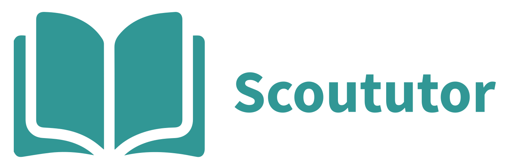

<h1 align="center">
    
</h1>

# Scoututor

<!-- This space should be used for integrations status -->

## 🚀 Getting Started

These instructions are ment to be followed by anyone who intends to run the
project on their local machine for development or testing purposes.

## 📥 Prerequisites

You need the following software in order to run the project on your local
machine:

- Node.js 12.0
- Blitz.js

You can install **Node.js** by visiting their
[website](https://nodejs.org/en/download/). Once you have it installed you can
install **Blitz.js** by running `npm install -g blitz --legacy-peer-deps`.

## 🔨 Development

### Development environment setup

First of all you should install the necessary dependencies by running:

`npm install`

Then, you must create the container that contains the database, perform the
migrations and populate the database with necessary information by running:

`bin/start-app`

### Development commands

Once you start the development server you can head to http://localhost:3000 to
see the result.

Here are some helpful development commands:

Start a development server:

`blitz dev`

Create a production build:

`blitz build`

Start a production server:

`blitz start`

Export your Blitz app as a static application:

`blitz export`

Run Prisma commands:

`blitz prisma`

Generate new files for your Blitz project:

`blitz generate`

Install a recipe:

`blitz install`

Display help for Blitz:

`blitz help`

Run project tests:

`blitz test`

## 🔗 References

- [Get started with Blitz](https://blitzjs.com/docs/get-started)
- [Next.js - Getting Started](https://nextjs.org/docs/getting-started)
